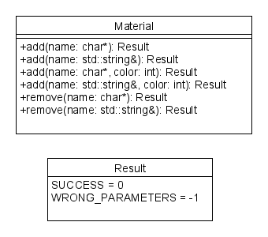

# Proposal 01.2 - Rework of the engine tool

## Current situation

## Problem

The engine tool (formally known as ShaderTool) in its current state has several disadvantages

1. The Shader and pipe system uses code generation which adds a lot of abstraction. It generates unnecessary code. It is inflexible and not expandable. On top of that it creates additional dependencies.
2. It is slow and tedious because the interface works over strings which is a result of the command line infrastructure.
3. We need to write a lot of redundant code.
4. We need a lot of redundant artifacts
5. The current process API of C++ does not allow for bidirektional communication between the engine tool and the editor itself.

## Solution

The solution would be to rework the entire system to add a layer of abstraction within the engine tool. The best case would be to make a static library out of the core systems. The second system would then be build on top of this library to help the optimizer to optimize away anything unnecessary. The would reduce or remove problem 2, 4 and 5 entirely. If we now incorporate the shader and pipe systems into the resource system it would remove all build dependencies to the engine it self.

### Proposal

The core systems should consist of namespaces and the according methods in the namespace. Error handling should be done by return codes.

## Pros and Cons

### Pros

* Removal of unnecessary dependencies
* Allows for bidirektional communication
* Hence it removes redundant code
* Adds better expandability
* Better for the optimizer
* Removes a lot of abstraction
* Removes a lot of complexity

### Cons

* Would need a change from C# to C++ as language
* This would render *all* of the current code unusable
* We would need to change the library from NewtonSoft.Json

## Conclusion

I think that the complete rewrite of the system is justified by the benefits we have from changing the language. The library change, on the other hand, is a minor problem. It could be replaced by niels lohman's json C++ API which we already use because of the communication problems seen in 5. Hence it introduced a lot of redundancy.

## Recommendations

The usage of templates and macros is encouraged to further remove redundancy.
