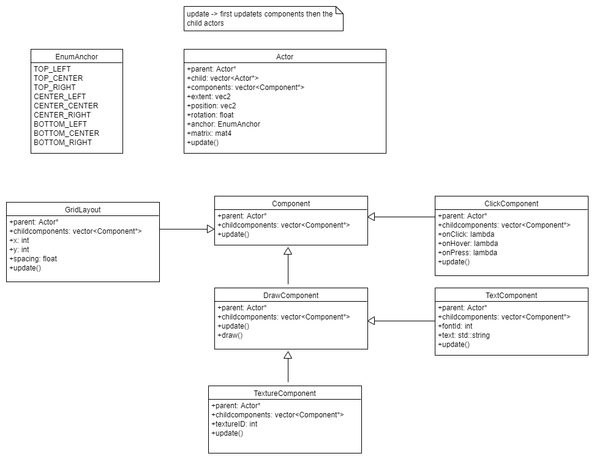

# Proposal 02.1 - Rework of the UI System

[Criticality-Level: Level 1](https://troblecodings.github.io/data-diagrams/criticality-level.html)

## Current situation

## Problem

The current UISystem is inflexible and pretty much unusable as it only contains 2 methods that are impractical. It is missing dynamik layouting.

## Solution

The solution would be to rework the entire system to add a layer of abstraction for the user to make it more developer friendly. However this should only be a wrapper and under the hood contain data oriented design.

### Proposal

We would need a standard ECS for the public API. The backend API should be data oriented as possible.

## Pros and Cons

### Pros

* Own shader pipes
* Expendability
* Dynamic layouts

### Cons

* it is probably a bit slower

## Conclusion

It is justified to write this system.

## Recommendations

The usage of templates and macros as well as a ECS is encouraged to further remove redundancy.

## Status

Status: RFC

### Implementation details
